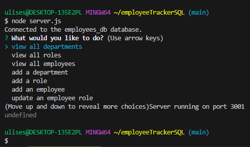

# employeeTrackerSQL
Project was created to help manage a company's employee database, using Node.js, Inquirer, and MySQL. Will circle back with video demo once application is fixed

## Built with 
Project coded using mySQL, Node.js, Inquirer, javascript, and express

## Installation 
To install necessary dependencies, run the following command:
```
npm install
```

## Usage
To run the application, run the following command:
```
node server.js
```

## Screenshots



## License
This project is licensed under the MIT license. See license [here](./LICENSE)


## Acknowledgements
[MDN Website](https://developer.mozilla.org/en-US/)
[ChatGPT](https://chat.openai.com/)